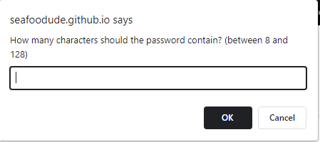
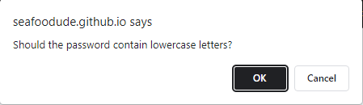
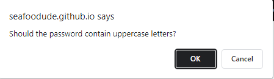
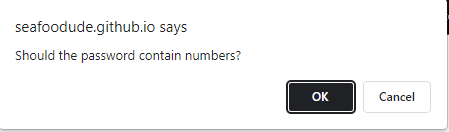
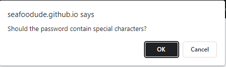

# Homework 3 PassGen

https://seafoodude.github.io/homework-3-passgen/

## Description

This Homework 3 PassGen was created for boot camp students who were going through Module 03. It contains a random password generator that is able to create a random password based on criteria given from the user.

My motivation came from my desire to learn Javascript and apply it in creating a random password generator.
I created this password generator to show that I have learned and absorbed the information given to me through the Module 03 requirement from the UCLA coding bootcamp.
This helped me to achieve a foothold in building more complex and functional Javascript programs in my future projects.
I learned how to build a password generator to display my knowledge and understanding of Javascript.

## Table of Contents 

- [Installation](#installation)
- [Usage](#usage)
- [Credits](#credits)
- [License](#license)

## Installation

N/A

## Usage

To use this Homework 3 PassGen, you can click on the generate password button, and decide on the criteria through the given prompts. For suggestions on what to do first, feel free to click on the generate password button. It will prompt a series of criteria (character length, upper/lowercase, numeric, and special characters), and display a random password with those criteria at the end.

**SCREENSHOTS**

## Credits

N/A

## License

Please refer to the LICENSE in the repo.